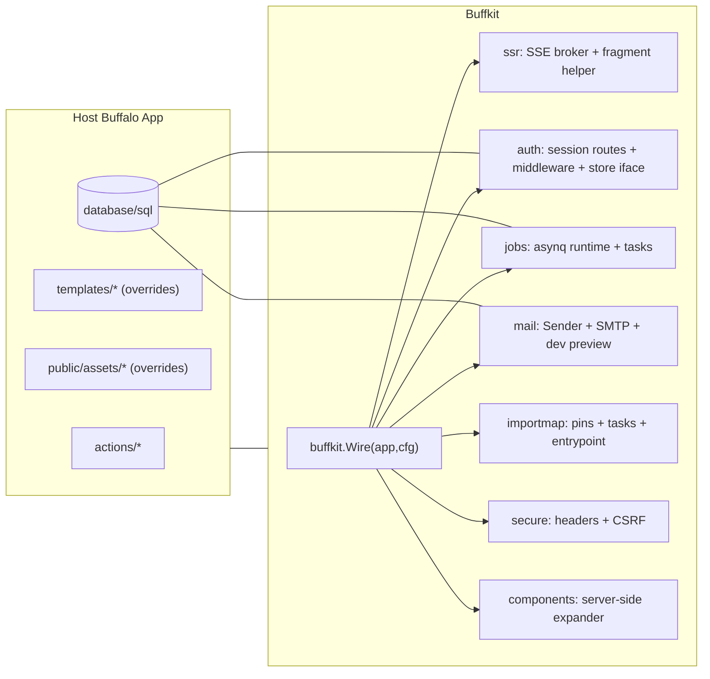

# Buffkit Specification (v0.1)
**Status:** Draft
**Author:** JJ + ChatGPT
**Scope:** Opinionated SSR stack for Buffalo (Go) to replace Rails/Loco for 2025-era server-rendered apps.
**Non-goal:** APIs-first; heavy JS bundlers; ORM lock-in.

---

## 1. Goals & Non‑Goals
### Goals
- **SSR-first**: HTML rendered on the server. htmx drives pull; SSE drives push.
- **Batteries included**: auth, jobs, mail, importmap, secure defaults, component library.
- **Composable**: install via `buffkit.Wire(app, cfg)`; each feature mountable/replaceable.
- **Shadowable**: app can override any template/asset by path.
- **Zero bundler**: JS via **import maps** (CDN pins or vendored files). Tailwind via CLI.
- **DB-agnostic**: use `database/sql`; host may use Pop/GORM/sqlc independently.

### Non‑Goals
- Providing a full ORM.
- SPA tooling or API shape decisions.
- Client-side routing/state frameworks.
- Asset pipeline beyond Tailwind CLI and import maps.

---

## 2. Architecture Overview
Buffkit provides mountable packages installed via a single `Wire()` call.



---

## 3. Packages & Responsibilities

### 3.1 `buffkit/ssr`
- `/events` SSE endpoint with **heartbeats** (default 25s).
- In‑memory **Broker** with `Broadcast(event string, html []byte)`.
- `RenderPartial(c, name, data)` helper to render fragments once, reuse for htmx response **and** SSE payload.
- **Client snippet** (in base layout): opens `EventSource("/events")` and swaps via `outerHTML` on a known target id.

**Key decisions**
- **One source of truth**: server-rendered HTML fragments.
- **Backpressure**: non-blocking channel send; drop if slow client (metrics TODO).

### 3.2 `buffkit/auth`
- **Session cookie** auth: `RequireLogin` middleware.
- Routes: `GET /login`, `POST /login`, `POST /logout` (templates included).
- **Store interface** only; default SQL store shipped. No ORM lock-in.

```go
type User struct { ID, Email, PasswordDigest string; CreatedAt, UpdatedAt time.Time }
type UserStore interface {
  Create(ctx context.Context, u *User) error
  ByEmail(ctx context.Context, email string) (*User, error)
  ByID(ctx context.Context, id string) (*User, error)
  UpdatePassword(ctx context.Context, id, digest string) error
  ExistsEmail(ctx context.Context, email string) (bool, error)
}
```
- Password hashing via bcrypt (host wires hash/check; Buffkit provides small helpers).

**Templates**
- `templates/auth/login.plush.html` (shadowable).

### 3.3 `buffkit/jobs`
- **Asynq** client/server/mux wrapper.
- Task: `jobs:worker` (grift).
- Convenience enqueue helpers (e.g., `EnqueueWelcomeEmail`).

**Non-goal**: define global job schema; keep tasks per-app. Buffkit provides structure only.

### 3.4 `buffkit/mail`
- Interface‑first design:
```go
type Message struct{ To, Subject, Text, HTML string }
type Sender interface{ Send(context.Context, Message) error }
```
- Default `SMTPSender` (configurable host/port/auth).
- Dev preview route `/__mail/preview` (enabled in Dev).
- Optional mail templates.

### 3.5 `buffkit/importmap`
- `importmap.json` defaults:
  - `"app": "/assets/js/index.js"`
  - `"controllers/": "/assets/js/controllers/"`
  - `"alpinejs": "https://esm.sh/alpinejs@<pinned>"`
  - `"htmx.org": "https://unpkg.com/htmx.org@<pinned>/dist/htmx.js"`
  - Optionally `"twp-elements"` or similar for JS‑free widgets via custom elements.
- Tasks:
  - `importmap:pin NAME URL [--download]` (optional vendoring to `/assets/vendor/*` with content hash)
  - `importmap:print` → emits `<script type="importmap">...</script>`
- Base layout includes import map + entry module.

### 3.6 `buffkit/secure`
- Security headers via `unrolled/secure` (X-Frame-Options deny; X-Content-Type-Options nosniff; XSS filter).
- CSRF middleware (Buffalo’s `mw-csrf`).

### 3.7 `buffkit/components`
- Server‑side **custom tags**: `<bk-*>` expanded post‑render.
- Registry maps tag → renderer (renders a Plush partial with attributes/slots).
- **Slots**: `<bk-slot name="...">` captured as named strings; default slot is the element content.
- Middleware buffers HTML 200 responses; expands tags; writes result.
- **Override**: app can shadow any `templates/components/*.plush.html` file.

---

## 4. Configuration

```go
type Config struct {
  DevMode    bool
  AuthSecret []byte          // cookie/session key
  RedisURL   string          // jobs
  SMTPAddr   string          // e.g. "localhost:1025"
  SMTPUser   string
  SMTPPass   string
  Dialect    string          // "postgres" | "sqlite" | "mysql"
}
```
- `Wire(app, cfg)` installs packages; returns `*Kit` handles:
```go
type Kit struct {
  Broker *ssr.Broker
  // possibly expose Jobs Runtime, Mailer, Auth hooks as fields
}
```

**Environment**
- `DATABASE_URL` used by Buffkit grift tasks (migrations), else host provides `*sql.DB` to stores.

---

## 5. Database & Migrations

### Principles
- **`database/sql` only**; no ORM dependency.
- **Forward migrations** in lexical order; optional downs.
- **Ledger** table: `buffkit_migrations(version TEXT PK, applied_at TIMESTAMP)`.

### Layout
```
buffkit/db/migrations/
  auth/
    0001_users.up.sql
    0001_users.down.sql
  mail/
    0001_outbox.up.sql
```

### Runner API
```go
type Runner struct {
  DB      *sql.DB
  Dialect Dialect // Postgres | SQLite | MySQL
  Table   string  // default "buffkit_migrations"
}
func (r *Runner) Migrate(ctx context.Context) error
func (r *Runner) Status(ctx context.Context) (applied, pending []string, _ error)
func (r *Runner) Down(ctx context.Context, n int) error
```

### Tasks
- `buffkit:migrate` → apply all ups
- `buffkit:migrate:status` → list applied/pending
- `buffkit:migrate:down N` → rollback last N (where downs exist)

**SQL example (Postgres)**
```sql
CREATE EXTENSION IF NOT EXISTS pgcrypto;
CREATE TABLE IF NOT EXISTS users (
  id UUID PRIMARY KEY DEFAULT gen_random_uuid(),
  email TEXT NOT NULL UNIQUE,
  password_digest TEXT NOT NULL,
  extra JSONB NOT NULL DEFAULT '{}'::jsonb,
  created_at TIMESTAMPTZ NOT NULL DEFAULT now(),
  updated_at TIMESTAMPTZ NOT NULL DEFAULT now()
);
CREATE INDEX IF NOT EXISTS idx_users_email ON users (email);
```

---

## 6. Templates & Assets (Override Rules)

- **Order of render sources**: Buffkit embedded templates added first; app’s `templates/` added **after** → app shadows specific files.
- **Static assets**: Buffkit embedded `/public/assets/*` served first; app’s `public/assets/*` mounted after → shadow per file.
- **Import map**: default `importmap.json` included; app may replace or use tasks to mutate.

**Base layout includes:**
- `<script type="importmap"> ... </script>`
- `<script type="module"> import "htmx.org"; import Alpine ...; import "app"; </script>`
- SSE bootstrap (`new EventSource("/events")`).

---

## 7. Components (Server‑Side `<bk-*>`)

### Authoring
```html
<bk-button href="/save" variant="primary">Save</bk-button>

<bk-dropdown>
  <bk-slot name="trigger">Menu</bk-slot>
  <a href="/a">Item A</a>
  <a href="/b">Item B</a>
</bk-dropdown>
```

### Rendering
- Renderer receives **attributes** and **slots**; returns HTML fragment.
- Buffkit ships a small set (`bk-button`, `bk-card`, `bk-dropdown`).

### Performance
- Expansion only for HTML `200` responses.
- Can scope middleware to selected routes if needed.
- O(N) DOM walk; cheap for typical SSR pages.

---

## 8. Auth Flow (Devise‑lite)

1. `GET /login` renders form.
2. `POST /login` → look up user by email via `UserStore` → compare bcrypt → set session key → redirect.
3. `POST /logout` → delete session key → redirect to `/login`.
4. `RequireLogin` middleware guards protected routes.

**Hooks**
- `auth.UseStore(UserStore)` to swap default SQL store.
- Optional `BeforeLogin/AfterLogin` hook handlers.

**Security**
- CSRF on POSTs.
- Cookie: `HttpOnly`, `Secure` in prod, `SameSite=Lax` (configurable).

---

## 9. Jobs (ActiveJob‑lite)

- `jobs.Runtime` encapsulates Asynq client/server/mux.
- `buffalo task jobs:worker` runs workers.
- Example handler: `"email:welcome" → mail.Sender.Send(...)`.

**Host responsibilities**
- Provide `REDIS_URL` or config value.
- Add app-specific tasks on `Runtime.Mux`.

---

## 10. Mail (ActionMailer‑lite)

- Implement `Sender` (default SMTP provided).
- Develop templates under `templates/mail/*` (shadowable).
- Dev mode: `/__mail/preview` renders known mails (no send).

---

## 11. Import Maps (Rails‑style)

- Managed via `importmap.json` and tasks.
- **CDN first**; optionally `--download` to vendor to `/assets/vendor/*` with hashed filenames.
- **Pin examples**:
  ```bash
  buffalo task importmap:pin alpinejs https://esm.sh/alpinejs@3.14.1
  buffalo task importmap:pin htmx.org https://unpkg.com/htmx.org@1.9.12/dist/htmx.js
  buffalo task importmap:print > public/assets/importmap.tag.html
  ```

**CSP**
- Recommend: `script-src 'self' https://esm.sh https://unpkg.com` (+ others you pin).

---

## 12. Security Defaults

- `unrolled/secure` headers.
- CSRF middleware.
- Session cookie settings sane defaults.
- Optional rate-limit middleware (future).

---

## 13. Testing Strategy

- **Unit**: render partials, component expansion, auth handler logic (with fake `UserStore`), mail sender stub.
- **Integration**: htmx POSTs using `httptest`; assert returned fragments.
- **SSE**: test broker with a fake writer; ensure framing & heartbeat cadence.
- **Migrations**: run `Runner.Migrate()` against a temp DB and verify schema.

---

## 14. Quickstart

```go
// actions/app.go
func App() *buffalo.App {
  app := buffalo.New(buffalo.Options{})
  kit, _ := buffkit.Wire(app, buffkit.Config{
    DevMode: true,
    AuthSecret: []byte("change-me"),
    RedisURL: "redis://127.0.0.1:6379/0",
    SMTPAddr: "localhost:1025",
    Dialect: "postgres",
  })
  _ = kit // use kit.Broker if needed
  app.GET("/", Home)
  return app
}
```

```bash
# install pins
buffalo task importmap:pin alpinejs https://esm.sh/alpinejs@3.14.1
buffalo task importmap:pin htmx.org  https://unpkg.com/htmx.org@1.9.12/dist/htmx.js

# apply Buffkit migrations (users, etc.)
buffalo task buffkit:migrate

# run
buffalo dev
```

---

## 15. Versioning & Upgrades

- **SemVer** for Buffkit.
- Migrations **append-only**; never mutate existing files.
- Deprecations: keep old behavior behind config flags for at least one minor release.

---

## 16. Appendix: Minimal Interfaces (for hosts to implement, if desired)

```go
// stores.go
type DBTX interface {
  ExecContext(ctx context.Context, q string, args ...any) (sql.Result, error)
  QueryContext(ctx context.Context, q string, args ...any) (*sql.Rows, error)
  QueryRowContext(ctx context.Context, q string, args ...any) *sql.Row
}

// auth
type UserStore interface { /* as above */ }
func UseUserStore(s UserStore) // swap default store

// mail
type Sender interface { Send(context.Context, Message) error }
func UseSender(s Sender)

// jobs
type Runtime struct { Client *asynq.Client; Server *asynq.Server; Mux *asynq.ServeMux }

// components
type Renderer func(attrs map[string]string, slots map[string]string) ([]byte, error)
func RegisterComponent(name string, r Renderer)
```

---

## 17. Out of Scope / Later
- OAuth/OIDC providers (can be an add-on kit).
- File storage adapters.
- Admin UI scaffolding.
- Rate limiting and audit logging.
- Multi-tenant session stores.
