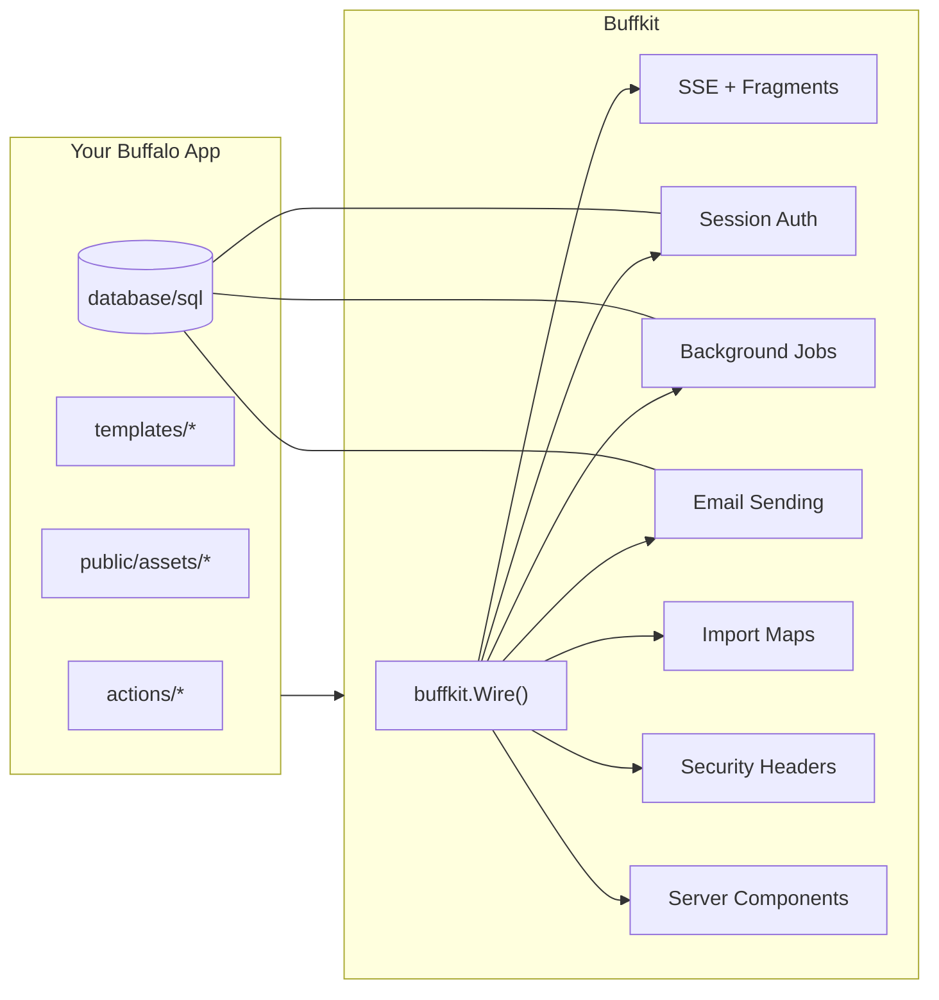

# Buffkit

<div align="center">

[](https://github.com/johnjansen/buffkit/actions/workflows/test.yml)
[](https://codecov.io/gh/johnjansen/buffkit)
[](https://goreportcard.com/report/github.com/johnjansen/buffkit)
[](https://pkg.go.dev/github.com/johnjansen/buffkit)

[](https://go.dev/)
[](LICENSE)
[](https://github.com/johnjansen/buffkit/releases)
[](https://github.com/johnjansen/buffkit/graphs/commit-activity)

[](CONTRIBUTING.md)
[](https://github.com/johnjansen/buffkit/graphs/contributors)
[](https://github.com/johnjansen/buffkit/issues)
[](https://github.com/johnjansen/buffkit/network/members)

</div>

## 🤖 Agentic Development Trial

**This project represents an experimental approach to software development using AI agents.** We're using BDD-based specifications to deliver a moderately complex problem in a short time frame. This is a proving ground for an agentic development process that leverages:

- **[Zed.dev](https://zed.dev)** and **[Warp.dev](https://warp.dev)** as our primary development interfaces
- **Anthropic Claude Opus 4.1** doing the actual development work
- **Graphiti MCP server** for persistent agent memory and learning
- A self-evolving set of rules that guide the AI and enable continuous improvement

We hope this will eventually become a useful tool, but for now it serves as a testbed for exploring how AI agents can effectively collaborate in complex software development tasks.

### Our Agentic Development Process

We've developed a structured 4-step approach for building features with AI agents:

1. **High-Level Design & Problem Analysis** - Work with the LLM to think through the feature conceptually, discussing the big picture while diving into key details carefully. This mirrors a stand-up meeting or ideation workshop, identifying the feature's shape and potential challenges.

2. **BDD Scenario Creation** - Have the LLM stub out features and scenarios in Gherkin format, translating the conceptual design into concrete, testable behaviors.

3. **Human Review & Agreement** - Manually review the generated scenarios with your LLM pair to ensure the process makes sense and identify anything missing. This "we agree on the details" step is crucial before implementation begins.

4. **Iterative Implementation** - Get busy implementing one feature at a time, using the agreed-upon BDD scenarios as the guiding specification.

This process leverages the strengths of both human intuition and AI precision, ensuring features are well-thought-out before implementation while maintaining the rapid development cycles that agents enable.

---

> **⚠️ ALPHA STATUS - v0.1.0-alpha**
> 
> This project is in alpha. Core features are functional but the API may still change. Missing pieces:
> - Grift/CLI tasks for migrations and jobs
> - Some migration SQL files
> - Production deployment guides
> 
> Most features documented below are implemented and working.

An opinionated SSR-first stack for Buffalo (Go) that brings Rails-like batteries to server-rendered applications — without the bloat.

## What is Buffkit?

Buffkit is a composable plugin system for Buffalo applications that provides:
- **Server-side rendering first** with htmx for interactions and SSE for real-time updates
- **Zero JavaScript bundler** approach using import maps
- **Batteries included** with auth, background jobs, mail, components, and security defaults
- **Database agnostic** design using `database/sql` directly
- **Shadowable templates** allowing your app to override any built-in view

Think of it as Rails' conventions and developer experience, but built for Go's performance and simplicity.

## Features

### Core Packages (✅ = Complete, 🚧 = In Progress)

- **✅ SSR** - Server-sent events broker with reconnection, RenderPartial helper for fragments
- **✅ Auth** - Full authentication system with registration, login, sessions, password reset
- **✅ Mail** - SMTP and dev sender, preview at `/__mail/preview` in dev mode
- **✅ Jobs** - Asynq integration with email and session cleanup handlers
- **✅ Import Maps** - Pin/unpin, vendor support, content hashing
- **✅ Security** - Headers via unrolled/secure, CSRF middleware
- **✅ Components** - Server-side `<bk-*>` components with slots
- **✅ Migrations** - Multi-dialect support (PostgreSQL, MySQL, SQLite)
- **🚧 CLI Tasks** - Grift tasks for migrations and workers (not yet implemented)

### Philosophy

- **SSR-first**: HTML rendered on the server, htmx for interactions, SSE for push
- **Composable**: Install via `buffkit.Wire(app, cfg)` - each feature is mountable/replaceable
- **Shadowable**: Override any template or asset by placing it in your app
- **Zero bundler**: JavaScript via import maps, Tailwind via CLI
- **DB-agnostic**: Use `database/sql` - no ORM lock-in

## Installation

```bash
go get github.com/johnjansen/buffkit
```

## Quick Start

### 1. Wire Buffkit into your Buffalo app

```go
// actions/app.go
func App() *buffalo.App {
  app := buffalo.New(buffalo.Options{
    // your existing options
  })
  
  // Wire in Buffkit
  kit, err := buffkit.Wire(app, buffkit.Config{
    DevMode:    ENV == "development",
    AuthSecret: []byte(envy.Get("SESSION_SECRET", "change-me-in-production")),
    RedisURL:   envy.Get("REDIS_URL", "redis://127.0.0.1:6379/0"),
    SMTPAddr:   envy.Get("SMTP_ADDR", "localhost:1025"),
    Dialect:    "postgres", // or "sqlite" | "mysql"
  })
  if err != nil {
    return nil
  }
  
  // Use kit.Broker for SSE broadcasts if needed
  app.Use(func(next buffalo.Handler) buffalo.Handler {
    return func(c buffalo.Context) error {
      c.Set("broker", kit.Broker)
      return next(c)
    }
  })
  
  // Your routes
  app.GET("/", HomeHandler)
  
  // Protected routes
  auth := app.Group("/admin")
  auth.Use(buffkit.RequireLogin)
  auth.GET("/dashboard", AdminDashboard)
  
  return app
}
```

### 2. Set up JavaScript dependencies

```bash
# Install htmx and Alpine.js via import maps
buffalo task importmap:pin htmx.org https://unpkg.com/htmx.org@1.9.12/dist/htmx.js
buffalo task importmap:pin alpinejs https://esm.sh/alpinejs@3.14.1

# Optional: download for offline/vendor
buffalo task importmap:pin htmx.org https://unpkg.com/htmx.org@1.9.12/dist/htmx.js --download
```

### 3. Run migrations

```bash
# Apply Buffkit migrations (users table, etc.)
buffalo task buffkit:migrate

# Check migration status
buffalo task buffkit:migrate:status
```

### 4. Start your app

```bash
# Development
buffalo dev

# Start background job worker in another terminal
buffalo task jobs:worker
```

## Usage Examples

### Server-Sent Events (SSE)

Broadcast updates to all connected clients:

```go
func UpdateHandler(c buffalo.Context) error {
  broker := c.Value("broker").(*ssr.Broker)
  
  // Render a partial
  html, err := buffkit.RenderPartial(c, "partials/item", map[string]interface{}{
    "item": updatedItem,
  })
  
  // Broadcast to all clients
  broker.Broadcast("item-update", html)
  
  // Also return for htmx request
  return c.Render(200, r.HTML(html))
}
```

### Authentication

Protect routes with the auth middleware:

```go
// Require login for route group
admin := app.Group("/admin")
admin.Use(buffkit.RequireLogin)
admin.GET("/", AdminIndex)

// Or individual routes
app.GET("/profile", buffkit.RequireLogin(ProfileHandler))
```

Customize the user store:

```go
type MyUserStore struct {
  db *sql.DB
}

func (s *MyUserStore) ByEmail(ctx context.Context, email string) (*buffkit.User, error) {
  // Your implementation
}

// In app setup
buffkit.UseUserStore(&MyUserStore{db: db})
```

### Background Jobs

Define and enqueue jobs:

```go
// Define a job handler
kit.Jobs.Mux.HandleFunc("email:welcome", func(ctx context.Context, t *asynq.Task) error {
  var payload struct {
    UserID string `json:"user_id"`
  }
  if err := json.Unmarshal(t.Payload(), &payload); err != nil {
    return err
  }
  
  // Send welcome email
  return kit.Mail.Send(ctx, buffkit.Message{
    To:      user.Email,
    Subject: "Welcome!",
    HTML:    welcomeHTML,
  })
})

// Enqueue a job
task := asynq.NewTask("email:welcome", payload)
kit.Jobs.Client.Enqueue(task)
```

### Server Components

Use server-side components in templates:

```html
<!-- templates/index.plush.html -->
<bk-button href="/save" variant="primary">
  Save Changes
</bk-button>

<bk-card>
  <bk-slot name="header">
    <h2>Welcome</h2>
  </bk-slot>
  <p>This is the card body content.</p>
</bk-card>

<bk-dropdown>
  <bk-slot name="trigger">Options</bk-slot>
  <a href="/profile">Profile</a>
  <a href="/settings">Settings</a>
  <a href="/logout" data-method="POST">Logout</a>
</bk-dropdown>
```

### Mail Sending

```go
// Send email
err := kit.Mail.Send(ctx, buffkit.Message{
  To:      "user@example.com",
  Subject: "Your order is confirmed",
  HTML:    orderConfirmationHTML,
  Text:    orderConfirmationText,
})

// In development, preview emails at /__mail/preview
```

## Configuration

```go
type Config struct {
  DevMode    bool      // Enable dev tools like mail preview
  AuthSecret []byte    // Session encryption key
  RedisURL   string    // For background jobs
  SMTPAddr   string    // SMTP server address
  SMTPUser   string    // SMTP username
  SMTPPass   string    // SMTP password
  Dialect    string    // "postgres" | "sqlite" | "mysql"
}
```

Environment variables:
- `DATABASE_URL` - Used by migration tasks
- `REDIS_URL` - Redis connection for jobs
- `SESSION_SECRET` - Secret key for session cookies
- `SMTP_ADDR` - SMTP server (e.g., "smtp.sendgrid.net:587")

## Template & Asset Overrides

Buffkit templates and assets can be overridden by creating files at the same paths in your app:

```
your-app/
├── templates/
│   ├── auth/
│   │   └── login.plush.html    # Override login page
│   └── components/
│       └── button.plush.html   # Override bk-button component
└── public/
    └── assets/
        └── js/
            └── sse-client.js   # Override SSE client
```

## Database Migrations

Buffkit uses simple SQL migrations without ORM dependencies:

```
buffkit/db/migrations/
├── auth/
│   ├── 0001_users.up.sql
│   └── 0001_users.down.sql
└── mail/
    └── 0001_outbox.up.sql
```

Commands:
- `buffalo task buffkit:migrate` - Apply all pending migrations
- `buffalo task buffkit:migrate:status` - Show migration status
- `buffalo task buffkit:migrate:down N` - Rollback last N migrations

## Architecture



## Testing

```go
// Test with fake stores
func TestLogin(t *testing.T) {
  app := buffalo.New(buffalo.Options{})
  
  kit, _ := buffkit.Wire(app, buffkit.Config{
    DevMode: true,
    AuthSecret: []byte("test-secret"),
  })
  
  // Use in-memory user store for testing
  buffkit.UseUserStore(&FakeUserStore{})
  
  req := httptest.NewRequest("POST", "/login", strings.NewReader("email=test@example.com&password=secret"))
  res := httptest.NewRecorder()
  
  app.ServeHTTP(res, req)
  
  require.Equal(t, 302, res.Code)
  require.Contains(t, res.Header().Get("Set-Cookie"), "session=")
}
```

## Tasks

Buffkit provides several grift tasks:

- `buffkit:migrate` - Run database migrations
- `buffkit:migrate:status` - Show migration status
- `buffkit:migrate:down N` - Rollback N migrations
- `importmap:pin NAME URL [--download]` - Add JavaScript dependency
- `importmap:print` - Output import map HTML
- `jobs:worker` - Start background job worker

## Requirements

- Go 1.21+
- Buffalo v0.18+
- Redis (for background jobs)
- PostgreSQL, MySQL, or SQLite

## Contributing

This project follows the philosophy of simplicity and clarity:
- Keep it simple, keep it minimal
- One step, one purpose, one concern at a time
- Clarity beats cleverness
- Test everything

## License

MIT

## Status

**v0.1 - Draft Implementation**

This is an early implementation of the Buffkit specification. The API may change as we refine the developer experience. We're building this to replace Rails/Loco for 2025-era server-rendered applications.

## Credits

Built with inspiration from Rails' conventions, but designed for Go's simplicity and performance.